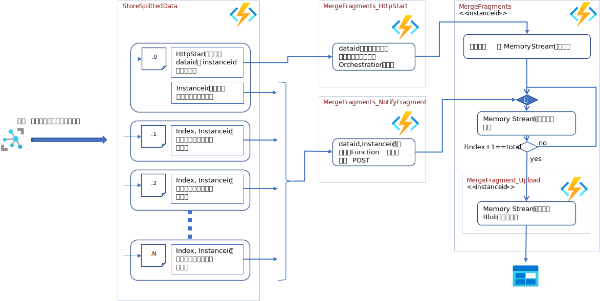

# Split Send And Received Combine
デバイス側でファイルを分割し、D2Cメッセージで IoT Hub に送信し、IoT Hub で受信したフラグメントをマージして復元し、Blob として Storage に保存するサンプル。  


## セットアップ  
### ファイルフラグメントのマージ用 Durable Function 
[MergeData](MergeData) を、Azure にデプロイし、Function の"設定"→"構成"
で、アプリケーション設定、接続文字列を以下の通りに設定する。  
|名前|種別|設定値|
|-|-|-|
|outputblobstorage|接続文字列|マージしたファイルを保存するストレージアカウントの接続文字列|


### IoT Hub からメッセージを受信し、MergeData を起動する Function
次に、[StoreSplittedData](StoreSplittedData) を、Azure にデプロイし、Function の"設定"→"構成"
で、アプリケーション設定、接続文字列を以下の通りに設定する。  
|名前|種別|設定値|
|-|-|-|
|iothubconnectionstring|アプリケーション設定|IoT Hub の service ロールの接続文字列|
|webhook_starter|アプリケーション設定| MergeData の MergeFragments_HttpStart の URI|
|webhook_notify|アプリケーション設定| MergeData の MergeFragments_NotifyFragment の URI|


---
## テスト 
[SplitAndSendLargeFileSimulator](SplitAndSendLargeFileSimulator) を、Visual Studio 2019 もしくは、VS Code でプロジェクトを開き、MainWindow.xaml.cs の26行目付近の
```cs
        readonly string iothubCS = "<- Device Connection String ->";
```
の文字列の部分を、IoT Hub に登録した IoT Device の接続文字列で置き換える。  
プロジェクトを実行する。  
### IoT Device のシミュレーション  
1. <b>Connect</b> をクリック  
2. <b>Select File</b> をクリックし、分割送信するファイルを選択する。  
3. <b>Send</b> をクリックし、送信を開始する。  

### フラグメント群のマージのテスト  
1. <b>Enable</b> をチェック  
2. <b>Select File</b> をクリックし、分割送信するファイルを選択する。  
3. <b>BaseUri</b> に、MergeData をデプロイした Function の起動用 URLの、/api より前の部分をコピー＆ペーストする。 
4. <b>Invoke Start</b> をクリック
5. <b>Invoke Notify</b> をフラグメントの数だけクリック  

---
## 注意  
このサンプルは、Function の起動において、ユーザー認証等は考慮していない。実際に利用する場合には、適切なアクセス権の設定等を行うこと。  
